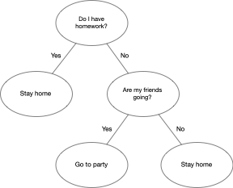
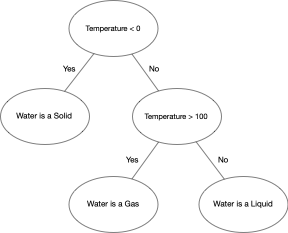
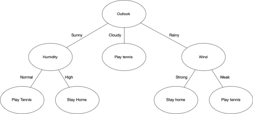

# Decision Tree Learning Models

Everyday we try to make decisions about actions we will take. These usually can be structures in a series of conditions, for example "I can go to the party only if I don't have homework for tomorrow. If I don't have homework I will only go if my friends are also going". These conditions seem very intuitive and are very easy to follow, and it can be made even more clear if we show it in the following style



This type of diagram is called a **decision tree** since we have a **root node** at the top and if we follow each node's decision we can end up at a **leaf node** with a final decision that was made. Here we will see how these trees can  be built and how we can learn these tree structures from labeled data.

## Decision Trees

Just like we showed before, decision trees are a way to represent knowledge on a subject and to arrive to conclusions based on the data that is given. This is done by taking a decision at each node, follow that child, take another decision at the child node and so on. We continue until we get to a leaf node, which contains the conclusion that was taken. For example, a decision can be taken by asking if a numerical value is above or below a certain threshold.  




One can also make decisions by asking if a certain categorical variable takes a certain value in the data. 




## Decision tree model

Now that we have seen decision trees we will procede to show how we can learn this structure from labeled data. Let's say we want to learn a model to decide if we should go to play tennis or not, just like in `reference play tennis diagram`, and for this we have previous data of the decisions we made in the past and under which circumstances these were made.

|    | outlook | temperature | humidity | wind   | play tennis |
|----|---------|-------------|----------|--------|-------------|
| 1  | sunny   | high        | high     | weak   | no          |
| 2  | sunny   | high        | high     | strong | no          |
| 3  | cloudy  | high        | high     | weak   | yes         |
| 4  | rainy   | medium      | high     | weak   | yes         |
| 5  | rainy   | low         | normal   | weak   | yes         |
| 6  | rainy   | low         | normal   | strong | no          |
| 7  | cloudy  | low         | normal   | strong | yes         |
| 8  | sunny   | medium      | high     | weak   | no          |
| 9  | sunny   | low         | normal   | weak   | yes         |
| 10 | rainy   | medium      | normal   | weak   | yes         |
| 11 | sunny   | medium      | normal   | strong | yes         |
| 12 | cloudy  | medium      | high     | strong | yes         |
| 13 | cloudy  | high        | normal   | weak   | yes         |
| 14 | rainy   | medium      | high     | strong | no          |

Based on this examples we would like to have an algorithm that builds a decision tree that we can use in the future to decide if we should go to play tennis or if we should stay home.

### ID3 Algorithm

One algorithm that can be used to learn a decision tree from data is called ID3. This algorithm is simple to understand and implement, but one of its downfalls is that it only works for categorical data. We will later see the algorithm C4.5, which extends ID3 to be able to handle numerical data as well as missing data. For now, we will see how ID3 can be used to build a decision tree from the given examples.

ID3 can be briefly summarised in the following instructions

```
ID3(Training set S, Attributes)
1) Create root node for the tree
2) If all examples in S have the same label, return leaf node with that label
3) If Attributes is empty, return leaf node with most common label
4) Else
5)    Let v <- Attribute that returns best Information Gain
6)    For all posible values, v_j, of v:
7)      Add a new child of root (corresponding to the test v=v_j)
8)      Let Examples(v_j) be the instances of S where v=v_j
9)      If Examples(v_j) is empty
10)        Return leaf node with most common label in the examples
11)      Else
12)       Return ID3(Examples(v_j), Attributes / {v})
```

This is all the ID3 algorithm, in short what the algorithm does is find the attribute that gives the best information gain, split the dataset on that attribute and then repeat for each of its childs using the remaining attributes. We will procede to explain in depth what each step refers to. 

#### Stopping criteria

We can see in step 12 that this algorithm follows a recursive strategy, after each split it will repeat the same process for every child node. This is why we need some conditions to tell the algorithm when to stop and return a value. This conditions are specified in steps 2 and 3. The first condition says that if the dataset S is perfectly label, then you should stop the recursion and return a leaf node with the label. The second condition says that if the set of attributes is empty, then you must return a leaf node with the most common label. This step is important because once we choose an attribute to make a split that attribute will no longer be considered in the rest of the splits coming below it in the hierarchy. This means that it is posible that at one step we will run out of attributes to use. In this case we will say that by default you should return a leaf node with the most common label in the examples.

#### Information Gain

To compare how good is each attribute to split the data we have to define a metric that tells us what a "good" separation is. In this case, our mesure of how mixed or "impure" the dataset labels are will be the **entropy** of the data.

The entropy is a measure that comes from the field of information theory. The goal is to be able to quantify how much uncertainty is carried by a random event. The formal definition of the entropy of a random variable $T$ is as follows:

$$H(T)=\mathbb{E}[\log_2(T)]=-\sum_i p_i \log_2(p_i)$$

Where $p_i$ is the probability of the random variable $T$ is equal to $i$. Lets start with an example and then we will explain why this measure is useful for decision trees. Let's think that we have a machine that can randomly give apples and oranges. If we had a probability of 0 of obtaining oranges then it would not be a surprise that we get only apples and never oranges, so this event carries no uncertainty. In this case the random event has an entropy of 0. On the other hand, if the machine gave oranges 10 percent of the time, then the entropy of the random event $T$ would be

$$H(T) =- ( 0.1 \log_2(0.1) + 0.9 \log_2(0.9) ) = -(-0.332 - 0.136) = 0.468$$

Now the entropy is no longer 0 because the event now carries a bit of uncertainty. One can think of this measure as how likely we are to be correct when randomly assigning a label to the event. In the first case it will be easy because we always know that the machine will give us apples, while in the second case it will bit harder because now there is a 10% chance that the machine will give us an orange. Now if the machine gave apples and oranges with 50% chance for each we would have an entropy of 

$$H(T) =- ( 0.5 \log_2(0.5) + 0.5 \log_2(0.5) )= 1$$

which is the case where the output of the machine carries the most uncertainty. 

This concept is important for us because it gives us a way to quantify how much uncertainty there is at each node of a decision tree, and how "good" is that node at assigning a label to the data. If our decision tree node is able to make a split where its childs have only data from one label each then we would be able to say that this node is leaving no uncertainty in the data, since we would be able to perfectly predict each point. This will be the goal of the ID3 algorithm, and to get to that point we will introduce the notion of **information gain**. 

Information gain refers to how much the entropy of a random variable is reduced once we observe another random variable. In our case, we are interested on how the entropy of the target variable is reduced given that we know the value of one of the attributes. The information gain of a random variable $T$ given that we know an attribute $A$ can be expressed by

$$IG(T, A) = H(T) - H(T | A) =  H(T) - \sum_{a\in vals(A)} p_a H(T_a)$$

where $vals(a)$ is the possible values that attribute A can take, $p_a$ is the probability that attribute $A$ takes the value $a$ and $T_a$ correspond to the random variable $T|A=a$, meaning the random variable $T$ given that we know that the attribute $A$ takes the value of $T$. 

Lets see how to calculate the information gain in our tennis example. We would like to see how much information we gain about the playing tennis decision given the outlook. For this we would first like to know the entropy before making any splits in the data. Getting the probability of an event reduces to just seeing the proportion of that event occurring in the dataset. So to calculate the entropy we only have to do

$$H(play\ tennis) 
= - \left(p_{yes}\log_2\left(p_{yes}\right) + p_{no}\log_2\left(p_{no}\right)\right)
= - \left(\frac{9}{14}\log_2\left(\frac{9}{14}\right) + \frac{5}{14}\log_2\left(\frac{5}{14}\right)\right) = 0.940$$

Now we would like how much information we can gain given that we know the outlook. We will start by calculating the entropy of the $play\ tennis$ given that we know that the $outlook$ was $sunny$. This means that we are only interested in the following subset of example

|    | outlook | temperature | humidity | wind   | play tennis |
|----|---------|-------------|----------|--------|-------------|
| 1  | sunny   | high        | high     | weak   | no          |
| 2  | sunny   | high        | high     | strong | no          |
| 8  | sunny   | medium      | high     | weak   | no          |
| 9  | sunny   | low         | normal   | weak   | yes         |
| 11 | sunny   | medium      | normal   | strong | yes         |

