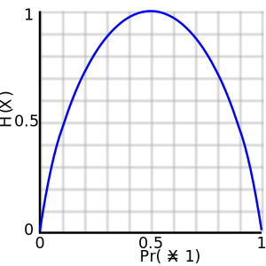

# Decision Tree Learning Models

Everyday we try to make decisions about actions we will take. These usually can be structures in a series of conditions, for example "I can go to the party only if I don't have homework for tomorrow. If I don't have homework I will only go if my friends are also going". These conditions seem very intuitive and are very easy to follow, and it can be made even more clear if we represent it as a diagram in which at each node we write a decision that has to be made. 

 

In this diagram there is a node with a question at the top, and depending on the answer we follow we will get to a different node. If we then continue answering the questions we will end up at a node with a final decision that was made (stay home or go to the party). This is an example of what is called a **decision tree**. A decision trees consist of a model structure in which we start at a **root node** which has a question and some child nodes. Depending on the answer to the question you will move the corresponding child node, which can also contain a question or give you a final decision. All paths will eventually lead to a node with a final decision, these are called **leaf nodes**. The goal of this chapter will be to see different techniques to learn decision trees from labeled data.

## Decision Trees

Just like we showed before, decision trees are a way to represent knowledge on a subject and to arrive to conclusions based on the information that is given. One arrives at this conclusion by asking a question at each node, depending on the answer to move to one of its child, and then continue until you have reached a final decision. An example of a question that can be made at a node is to ask if a numerical  variable is above or below certain value. This type of question will have two childs, one for when the condition is satisfied and another for when it is not.


One can also ask if a categorical variable takes a certain value. In this  case the node will as many of childs as categories the variable can take. 


## Decision tree model

Now that we have seen decision trees we will proceed to show how we can learn this structure from labeled data. The goal is that, given a dataset of examples and a target variable, we would like to build a decision tree  that we can use to classify future examples.

### ID3 Algorithm

One algorithm that can be used to learn a decision tree from data is called ID3 (Iterative Dichotomiser 3). This algorithm is simple to understand and implement, but one of its downfalls is that it only works for categorical data. We will later see the algorithm C4.5, which extends ID3 to be able to handle numerical data as well as missing data. For now, we will see how ID3 can be used to build a decision tree from the given examples.

ID3 can be briefly summarised in the following instructions:

* If all examples have the same label or if there are no more attributes that can be used, return a leaf node with a decision.
* If not, find the best attribute to split on (the one that gives the best information gain)
* For each possible value of the best attribute, create a child node and call the algorithm recursively on each node.

For a more detailed explanation see `reference pseudo-code`. It is important to note that when we make the recursive call to the algorithm we give it only the examples that satisfy the condition given by the corresponding child. We also exclude the attribute that was just used, meaning that in each branch an attribute can only be used once. This algorithm is designed to continue until all the examples are perfectly classified. If some examples have the same values for its attributes but different labels then the algorithm will use up all possible attributes trying to separate them and, once it runs out of attributes, it will create a leaf node with the most common label. 


```
ID3(Training set S, Attributes)
1) Create root node for the tree
2) If all examples in S have the same label, return leaf node with that label
3) If Attributes is empty, return leaf node with most common label
4) Else
5)    Let v <- Attribute that returns best Information Gain
6)    For all possible values, v_j, of v:
7)      Add a new child of root (corresponding to the test v=v_j)
8)      Let Examples(v_j) be the instances of S where v=v_j
9)      If Examples(v_j) is empty
10)        Return leaf node with most common label in the examples
11)      Else
12)       Return ID3(Examples(v_j), Attributes / {v})
```


#### Stopping criteria

Since this algorithm follows a recursive strategy we need some conditions to tell the algorithm when to stop and return a value. The first condition says that if the dataset $S$ is perfectly label, then you should stop the recursion and return a leaf node with the label. The second condition says that if the set of attributes is empty, then you must return a leaf node with the most common label. This step is important because once we choose an attribute to make a split that attribute will no longer be considered in the rest of the splits coming below it in the hierarchy. This means that it is possible that at one step we will run out of attributes to use. In this case we will say that by default you should return a leaf node with the most common label in the examples.

#### Best feature to make the split

To compare how good is each attribute to split the data we have to define a metric that tells us what a "good" separation is. In this case, our measure of how mixed or "impure" the dataset labels are will be the **entropy** of the data. An explanation of what is entropy and how it is calculated can be found in the Appendix, but one can just think of it as a measure of uncertainty that is carried by a random variable. In the case for decision trees it will represent how "mixed" or "impure" are the labels at a given node.

This concept is important for us because it gives us a way to quantify how "good" is that node at assigning a label to the data. If our decision tree node is able to make a split where its childs have examples from only one label each, then we would be able to perfectly predict the label each example. Here we would say that this node is leaving no uncertainty in the data. This will be the goal of the ID3 algorithm, and to get to that point we will introduce the notion of **information gain**. 

Information gain refers to how much the entropy of a random variable is reduced once we observe another random variable. In our case, we are interested on how the entropy of the target variable is reduced given that we know the value of one of the attributes. The information gain of a random variable $X$ given that we know an attribute $A$ can be expressed by

$$IG(X, A) = H(X) - H(X | A) =  H(X) - \sum_{a\in vals(A)} p(a) H(X|A=a)$$

The term $H(X | A)$ is the conditional entropy of the random variable $X$ given that we know the random variable $A$. A more detailed explanation can be found in the appendix, but for now it is enough to know that we compute the conditional entropy by adding entropy of $X$ given that we know that the attribute $A$ takes the value of $a$, weighted with the probability that the attribute $A$ takes the value of $a$, for all possible values of $A$.


#### Splitting and recursion

Now we get to the point of building our decision tree. We will do this in a *greedy* manner, meaning that at each step we will choose the attribute that gives us the best information gain, we will split on this attribute and then we will continue the algorithm with the remaining attributes that have not been chosen. 

#### Example

Let's say we want to learn a model to decide if we should go to play tennis or not, just like in `reference play tennis diagram`, and for this we have previous data of the decisions we made in the past and under which circumstances these were made.

|    | outlook | temperature | humidity | wind   | play tennis |
|----|---------|-------------|----------|--------|-------------|
| 1  | sunny   | high        | high     | weak   | no          |
| 2  | sunny   | high        | high     | strong | no          |
| 3  | cloudy  | high        | high     | weak   | yes         |
| 4  | rainy   | medium      | high     | weak   | yes         |
| 5  | rainy   | low         | normal   | weak   | yes         |
| 6  | rainy   | low         | normal   | strong | no          |
| 7  | cloudy  | low         | normal   | strong | yes         |
| 8  | sunny   | medium      | high     | weak   | no          |
| 9  | sunny   | low         | normal   | weak   | yes         |
| 10 | rainy   | medium      | normal   | weak   | yes         |
| 11 | sunny   | medium      | normal   | strong | yes         |
| 12 | cloudy  | medium      | high     | strong | yes         |
| 13 | cloudy  | high        | normal   | weak   | yes         |
| 14 | rainy   | medium      | high     | strong | no          |


None of the stopping criteria are satisfied, so we have to find the attribute that gives us the best information gain to make a split.

First we need know the entropy of the whole dataset. In this case the probability of playing tennis just the count of occurrences of $yes$ in the dataset over the total number of examples. For simplicity we will call this probability $p_{yes}$ and the probability of not playing tennis $p_{no}$. Then, the entropy of playing tennis would be

$$H(play\ tennis) 
= - \left(p_{yes}\log_2\left(p_{yes}\right) + p_{no}\log_2\left(p_{no}\right)\right)$$
$$= - \left(\frac{9}{14}\log_2\left(\frac{9}{14}\right) + \frac{5}{14}\log_2\left(\frac{5}{14}\right)\right) = 0.940$$

Now we would like how much information we can gain given that we know the $outlook$. We will start by calculating the entropy of the $play\ tennis$ given that we know that the $outlook$ was $sunny$. This means that we are only interested in the following subset of example

|    | outlook | temperature | humidity | wind   | play tennis |
|----|---------|-------------|----------|--------|-------------|
| 1  | sunny   | high        | high     | weak   | no          |
| 2  | sunny   | high        | high     | strong | no          |
| 8  | sunny   | medium      | high     | weak   | no          |
| 9  | sunny   | low         | normal   | weak   | yes         |
| 11 | sunny   | medium      | normal   | strong | yes         |

Here if we calculate the entropy and we get that 
$$H(play\ tennis |outlook=sunny) = 0.970$$ 

If we repeat this for the $cloudy$ and $rainy$ outlooks we will get that 
$$H(play\ tennis|outlook=rainy) = 0.970$$ 
$$H(play\ tennis|outlook=cloudy) = 0$$

We can now calculate the entropy of $play\ tenis$ given that we know the $outlook$

$$H(play\ tennis | outlook) = 
\frac{5}{14} H(play\ tennis | outlook = sunny)$$
$$+ \frac{5}{14} H(play\ tennis| outlook = rainy)$$
$$+ \frac{4}{14} H(play\ tennis| outlook = cloudy) $$
$$ = 0.724$$

And now we can finally calculate the information gain for $play\ tennis$ given that we know the $outlook$

$$IG(play\ tennis, outlook) = H(play\ tennis) - H(play\ tennis | outlook)
= 0.246$$

We now calculate the information gain given the other attributes, and we obtain that

$$ IG(play\ tennis, temperature) = 0.029 $$
$$ IG(play\ tennis, humidity) = 0.151 $$
$$ IG(play\ tennis, wind) = 0.048 $$


This means that best information gain is obtained when we observe the $outlook$. Since we know that the outlook can take the values of $sunny$, $cloudy$ and $rainy$ the first part of the decision tree we are building will only have these three childs


Now we have to repeat the process at each child, and in each one we will use the "splitted" dataset, meaning that we will consider the subset of examples given that we know the value of the $outlook$. 

We will start with the case where $outlook=cloudy$. In this case we will call the algorithm again, but only on the subset of examples were the $outlook$ is $cloudy$, and with the attributes that have not yet been used. So the dataset we are working with looks like the one in Table `reference following table`

|    | ~~outlook~~ | temperature | humidity | wind   | play tennis |
|----|-------------|-------------|----------|--------|-------------|
| 3  |   cloudy    | high        | high     | weak   | yes         |
| 7  |   cloudy    | low         | normal   | strong | yes         |
| 12 |   cloudy    | medium      | high     | strong | yes         |
| 13 |   cloudy    | high        | normal   | weak   | yes         |

We will follow the steps of ID3, so we have to start by checking the stopping criteria. We notice that here all the examples have the same label, so we return a leaf node with label $yes$. So far, our tree will look like the one in `figure of tree`


Now that we got to a leaf node we go back and continue with the other childs of $outlook$. We will now look at the case where the $outlook$ is $sunny$, the corresponding subset of examples can be seen in the Table `reference following table`. 

|    | ~~outlook~~ | temperature | humidity | wind   | play tennis |
|----|---------|-------------|----------|--------|-------------|
| 1  | sunny   | high        | high     | weak   | no          |
| 2  | sunny   | high        | high     | strong | no          |
| 8  | sunny   | medium      | high     | weak   | no          |
| 9  | sunny   | low         | normal   | weak   | yes         |
| 11 | sunny   | medium      | normal   | strong | yes         |

We check our stopping criteria but neither is satisfied. So now we calculate the information of this subset of examples. We will refer to it as $play\ tennis_{outlook=sunny}$, and we calculate the information gain given each of the remaining attributes

$$ IG(play\ tennis_{outlook =sunny}, temperature) = 0.570 $$
$$ IG(play\ tennis_{outlook =sunny}, humidity) = 0.970 $$
$$ IG(play\ tennis_{outlook =sunny}, wind) = 0.019 $$

So here the best information gain is obtained when splitting by humidity. 


Just like before, we will now choose one of the childs and we will perform the ID3 algorithm again. We will choose the subset of examples where the $humidity$ is $normal$, and we will only use the attributes that have not yet been used. The subset of examples we will be working with will look like this

|    | ~~outlook~~ | temperature | ~~humidity~~ | wind   | play tennis |
|----|---------|-------------|----------|--------|-------------|
| 9  | sunny   | low         | normal   | weak   | yes         |
| 11 | sunny   | medium      | normal   | strong | yes         |

Notice that we chose the subset of examples where $humidity=normal$ from our previous subset in which we had that $outlook=sunny$. We check our stopping conditions and we see that all examples have the same label, so we create a leaf node with label $yes$. 


Since we reached a leaf node we go back to the $humidity$ node and explore its other child, where the $humidity$ is $high$

|    | ~~outlook~~ | temperature | ~~humidity~~ | wind   | play tennis |
|----|---------|-------------|----------|--------|-------------|
| 1  | sunny   | high        | high     | weak   | no          |
| 2  | sunny   | high        | high     | strong | no          |
| 8  | sunny   | medium      | high     | weak   | no          |

Again, all examples have the same label so we create a leaf node with label $no$.


Now that the branch where $outlook$ is $sunny$ is complete, we go to the remaining child of $outlook$. We implement the same procedure as before, there we will see that the best information gain is obtained when splitting by $wind$, and after exploring both childs we will have completed the tree.


## Appendix: Entropy

Entropy is a measure that comes from the field of information theory. The goal is to be able to quantify how much uncertainty is carried by a random event. The formal definition of the entropy of a discrete random variable $X$ is as follows:

$$H(X)=\mathbb{E}[\log_2(X)]=-\sum_x p(x) \log_2\left(p(x)\right)$$

Where $p(x)=\mathbb{P}(X=x)$, meaning the probability of that random variable $X$ is equal to $x$. Note that we could use a logarithm of any base, but we will use base 2 since it is a convention in computer science to thinking about information in terms of bits. This measure can be interpreted as the amount of uncertainty, disorder or noise that is carried by a signal. 

For example, let's think that we have a machine that can randomly give apples and oranges. If we had a probability of 0 of obtaining oranges then it would not be a surprise that we get only apples and never oranges, so this event carries no uncertainty. In this case the random event has an entropy of 0. On the other hand, if the machine gave oranges 10 percent of the time, then the entropy of the random event $X$ would be

$$H(X) =- \left( 0.1 \log_2(0.1) + 0.9 \log_2(0.9) \right) = -\left(-0.332 - 0.136\right) = 0.468$$

Now the entropy is no longer 0 because the event now carries a bit of uncertainty. 

One can think of this measure as how likely we are to be correct when randomly assigning a label to the event. In the first case it will be easy because we always know that the machine will give us apples, while in the second case it will bit harder because now there is a 10% chance that the machine will give us an orange. Now if the machine gave apples and oranges with 50% chance for each we would have an entropy of 

$$H(X) =- \left( 0.5 \log_2(0.5) + 0.5 \log_2(0.5) \right)= 1$$

This machine could be modeled with a Bernoulli random variable. In these cases the entropy is bounded between 0 and 1, reaching at its maximum when the chance of the events happening are 50-50.



It is worth noting that if we had chosen another distribution our entropy could have been higher. For example, if our machine had given apples, oranges and bananas, with 20, 30 and 50% chance respectively, our entropy would be 

$$H(X) =- \left( 0.2 \log_2(0.2) + 0.3 \log_2(0.3) + 0.5 \log_2(0.5) \right)= 1.485$$


Another concept that is worth exploring is the **conditional entropy**, meaning the entropy of a random variable given that we know another random variable, this will be expressed as $H(Y|X)$. 

To define the conditional entropy we first have to look at the entropy of the random variable $Y|X=x$, which is the random variable $Y$ given that we now that the random variable $X$ took the value of $x$. If both $X$ and $Y$ are discrete this can be written as

$$H(Y|X=x)=\mathbb{E}[\log_2(Y|X=x)]= \sum_y P(Y=y |X=x) \log_2\left(P\left(Y=y |X=x\right)\right)$$

With this we can now define the entropy of a discrete random variable $Y$ given another discrete random variable $X$. This is achieved by taking the average of the entropy of $Y$ given that $X$ took the value $x$, weighting over the probability that $X=x$. 

$$H(Y | X) = \sum_x p(x)H(Y|X=x)$$

This can give us an idea of how much the uncertainty of the random variable $Y$ is reduced if we know that we will observe the random variable $X$. In the case that $X$ and $Y$ are independent then 

$$H(Y | X) = H(Y)$$
 


## Bibliography 

(fix later)

[Elements of Information Theory](http://staff.ustc.edu.cn/~cgong821/Wiley.Interscience.Elements.of.Information.Theory.Jul.2006.eBook-DDU.pdf)